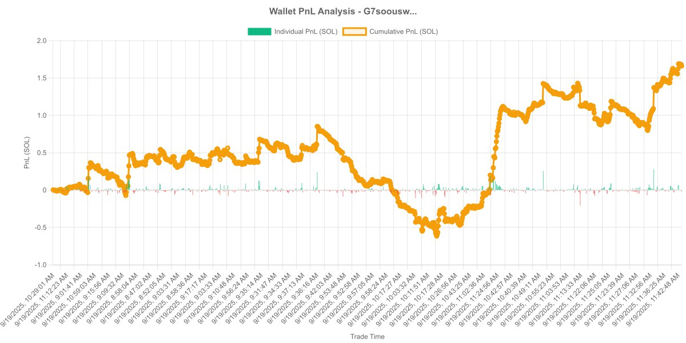
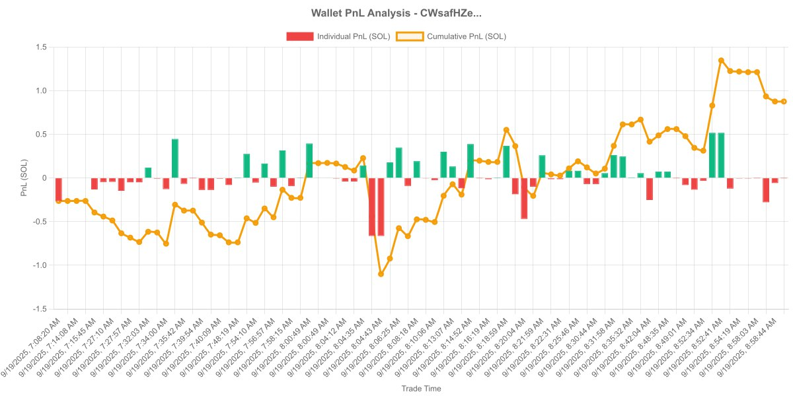
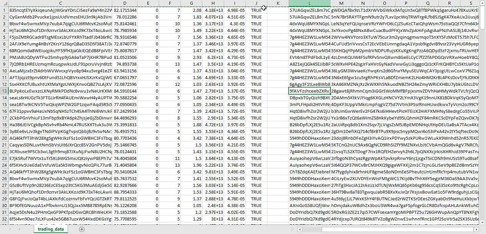

# Solana Wallet Analytics Telegram Tool

A powerful wallet analysis tool designed for building and testing strategies on the Solana blockchain. This Telegram bot provides comprehensive wallet analytics with advanced filtering and export capabilities.

## 🚀 Features

### 📊 PnL Analysis
- **Custom Time Windows**: Export PnL images across any custom time period
- **Visual Analytics**: Generate detailed profit/loss charts for strategy analysis
- **Historical Performance**: Track wallet performance over time

### 📈 Wallet Analytics Dashboard
- **Comprehensive Overview**: Get detailed insights into wallet performance
- **Real-time Data**: Access up-to-date wallet statistics
- **Interactive Interface**: User-friendly dashboard for easy navigation

### 📋 Data Export
- **CSV Export**: Export detailed wallet trade data in CSV format for further analysis
- **Custom Filters**: Apply user-defined filters to export specific data sets
- **Batch Processing**: Export multiple wallets simultaneously

### 🔍 Top 100 Pump.fun Wallets Discovery
- **Advanced Filtering**: Discover top-performing wallets based on custom criteria
- **Real-time Rankings**: Get the latest top 100 Pump.fun wallets
- **Performance Metrics**: Analyze wallet performance with detailed metrics

## 🛠️ Key Capabilities

- **🧨 Exporting PnL images across custom time windows**
- **🧨 Exporting detailed wallet trade data in CSV format**
- **🧨 Discovering the Top 100 Pump.fun wallets based on user-defined filters**

## 📱 Telegram Integration

This tool is designed to work seamlessly within Telegram, providing:
- Easy access through Telegram bot interface
- Real-time notifications and updates
- Secure wallet analysis without leaving the chat
- Mobile-friendly interface for on-the-go analysis

## 🎯 Use Cases

- **Strategy Development**: Test and refine trading strategies using historical data
- **Portfolio Analysis**: Analyze wallet performance and identify patterns
- **Market Research**: Discover top-performing wallets and their strategies
- **Risk Management**: Track PnL and identify potential risks
- **Performance Tracking**: Monitor wallet performance over time

## 🔧 Getting Started

1. Start a conversation with the bot on Telegram
2. Use the menu to access different features
3. Set your custom filters and time windows
4. Export data for further analysis

## 📊 Data Sources

The tool integrates with Solana blockchain data to provide:
- Real-time wallet balances
- Transaction history
- Token holdings
- Performance metrics
- Market data

## 🔒 Security

- All wallet analysis is performed securely
- No private keys are stored or transmitted
- Read-only access to public blockchain data
- Privacy-focused design

---

*Built for traders, analysts, and strategy developers who need powerful wallet analytics tools on the Solana blockchain.*
